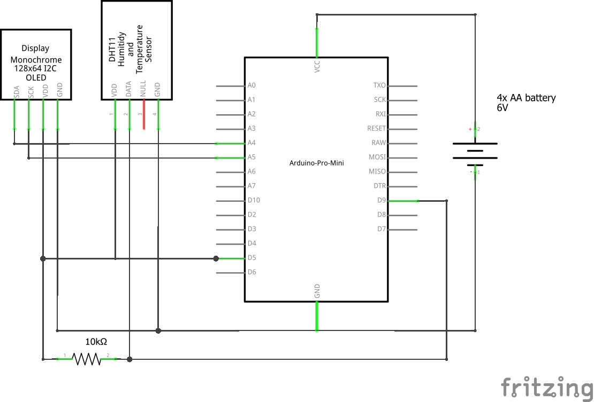

# Arduino DHT11 Hygrometer

## Dependencies

* Adafruit SSD1306 library [https://github.com/adafruit/Adafruit_SSD1306](https://github.com/adafruit/Adafruit_SSD1306)
* LowPower library [https://github.com/rocketscream/Low-Power](https://github.com/rocketscream/Low-Power)
* Adafruit DHT library [https://github.com/adafruit/DHT-sensor-library](https://github.com/adafruit/DHT-sensor-library)
* Adafruit Unified Sensor Library [https://github.com/adafruit/Adafruit_Sensor](https://github.com/adafruit/Adafruit_Sensor)